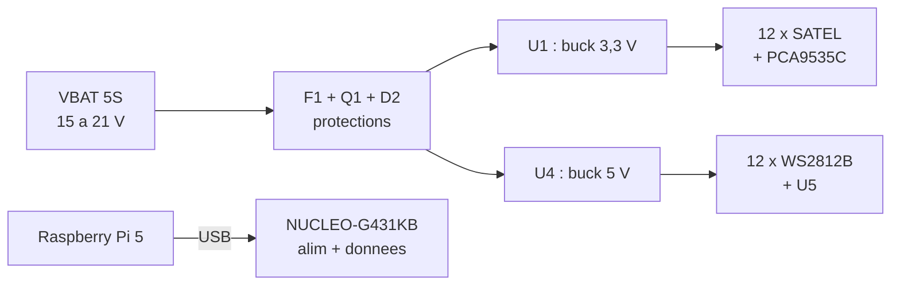
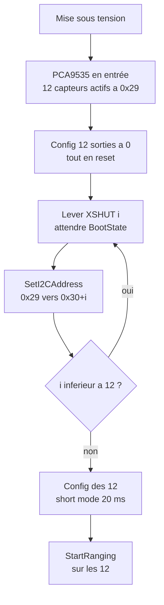

# Balise ToF 12× VL53L1X — Spécification du schéma (carte porteuse)

Sep 22, 2026 · @François

## Synthèse

Carte porteuse dodécagonale pour 12 VL53L1X montés sur cartes **VL53L1X-SATEL** complètes, reliées par nappes HE10. MCU : **NUCLEO-G431KB** enfichée. Liaison hôte en UART vers la Raspberry Pi 5. Alimentation depuis la batterie 5S brute distribuée par la carte de distribution du robot.

### Contraintes issues du modèle 3D

| Paramètre | Valeur mesurée |
| --- | --- |
| Capteurs | 12, azimuts espacés de 30,000° |
| Rayon du centre optique | 49,70 mm |
| Hauteur axe optique / plateau | 415 mm (toit 322 + 93) |
| Intérieur utile entre plats | 97,4 mm |
| Volume libre sous l'anneau de connecteurs | 43,9 mm de haut (z = −91 à −47) |
| Dégagement du cône de champ | ±58° minimum sur les 12 capteurs |

### Conséquences de conception

- **ROI 16×16 complète conservée.** Le plateau n'entre dans le champ qu'à 1,73 m, au-delà du besoin de 1,5 m et au-delà de la portée du short distance mode. Signal maximal préservé.
- **Short distance mode**, timing budget 20 ms, inter-measurement 25 ms → environ 40 Hz sur les 12 capteurs simultanément.
- **La carte principale se place sous l'anneau de connecteurs.** Dodécagone d'environ 95 mm entre plats, en gardant 1 mm de jeu par côté.

## Arbre d'alimentation

Deux buck indépendants depuis la batterie : l'un pour les capteurs, l'autre pour le bandeau LED. La Raspberry Pi 5 alimente la Nucleo par le câble USB qui porte déjà la liaison série.

### Pourquoi la Pi alimente la Nucleo

Si le câble USB lâche en match, la liaison de données est perdue de toute façon : maintenir le MCU en vie n'apporte rien. Autant confondre les deux fonctions dans un seul câble blindé. Cela supprime le rail 5 V, le LDO, son diviseur de retour et sa dissipation.

**Conséquence assumée.** Batterie allumée et Pi éteinte, les tirages I2C des SATEL réinjectent environ 3 mA dans le STM32 non alimenté, par ses diodes de protection. C'est très en deçà de la limite d'injection de 20 mA par broche, donc sans dommage, mais le MCU se trouve alors dans un état indéfini. Le cas ne survient qu'au débranchement de l'USB en maintenance, la Pi et la balise étant alimentées par le même pack.

### Bilan de consommation

| Charge | Rail | Moyen | Crête |
| --- | --- | --- | --- |
| 12 × VL53L1X en mesure | 3V3\_SENS | 216 mA | 480 mA |
| PCA9535C | 3V3\_SENS | 1 mA | 1 mA |
| **Total buck U1** | 3V3\_SENS | **217 mA** | **481 mA** |
| 12 × WS2812B | +5V | \~50 mA à 20 % | **720 mA** en blanc plein |
| 74AHCT1G125 | +5V | négligeable | négligeable |
| **Total buck U4** | +5V | **50 mA** | **720 mA** |
| NUCLEO-G431KB | USB de la Pi | 120 mA | 150 mA |

Les 12 capteurs déclenchent leurs VCSEL simultanément, donc les crêtes s'additionnent intégralement. C'est ce qui dimensionne le découplage du bloc E, pas le courant moyen. Un buck de 1 A laisse le double de marge.

### Tensions de référence

- Pack 5S plein : **21,0 V** (4,2 V/cellule)
- Nominal : 18,5 V
- Fin de décharge : **15,0 V** (3,0 V/cellule)
- Transitoire au branchement à chaud : jusqu'à **42 V** si l'entrée est purement céramique — d'où le bulk électrolytique du bloc A.

## Bloc A — Entrée batterie 5S et protections

Les fusibles de la carte de distribution protègent contre la surintensité, pas contre l'inversion de polarité ni contre les transitoires de câble. Ces trois fonctions restent locales.

&#91;image: Feuille A du schéma : entrée batterie 5S et protections\]

### Netlist

| Repère | Fonction | Connexions | Symbole KiCad |
| --- | --- | --- | --- |
| J1 | Entrée batterie, 2 points | 1 → VBAT\_IN, 2 → GND | `Conn_01x02` |
| F1 | Fusible 1 A / 63 V | VBAT\_IN → VBAT\_F | `Device:Fuse` |
| Q1 | P-MOS anti-inversion | **2 (D) → VBAT\_F**, **3 (S) → VBAT**, 1 (G) → GATE\_Q1 | `Device:Q_PMOS_GDS` |
| R1 | 100 kΩ | GATE\_Q1 → GND | `Device:R` |
| D1 | Zener 15 V, 500 mW | Anode → GATE\_Q1, Cathode → VBAT | `Device:D_Zener` |
| D2 | TVS **SMBJ22A**, unidirectionnelle | VBAT → GND | `Device:D_Zener`, symbole polarisé |
| C1 | 100 µF / 35 V électrolytique low-ESR | VBAT → GND | `Device:C_Polarized` |
| C2 | 10 µF / 50 V X7R | VBAT → GND | `Device:C` |
| C3 | 10 µF / 50 V X7R | VBAT → GND | `Device:C` |
| C4 | 100 nF / 50 V X7R | VBAT → GND | `Device:C` |

C1, C2, C3 et C4 sont **quatre branches parallèles indépendantes**, chacune reliant le rail VBAT à la masse. Mises en série, deux condensateurs de 10 µF ne donneraient que 5 µF, avec un point milieu flottant.

### Le sens de Q1 n'est pas celui qu'on dessine d'instinct

La diode de corps d'un MOSFET canal P va du **drain vers la source**. Pour qu'elle bloque en polarité inversée, il faut donc **le drain côté batterie et la source côté charge** — l'inverse de ce qu'on trouve dans beaucoup de schémas approximatifs.

En fonctionnement normal : la diode de corps conduit d'abord, la source monte à 20,3 V, la grille est tirée à la masse par R1, donc Vgs négatif et le canal court-circuite la diode. En inversion : Vgs devient positif, le canal reste bloqué, et la diode de corps est polarisée en inverse. Rien ne passe.

Dans KiCad, le symbole `Q_PMOS_GDS` encode l'ordre des broches dans son nom : **1 = grille, 2 = drain, 3 = source**. Le symbole lui-même n'affiche que les numéros, d'où l'intérêt du suffixe — les variantes `Q_PMOS_GSD` et `Q_PMOS_DGS` existent pour d'autres brochages de boîtier. Concrètement ici : la broche 2 reçoit le fil venant de F1, la broche 3 alimente le rail VBAT, la broche 1 descend vers R1 et D1.

Se fier aux numéros et non aux positions : une symétrie appliquée au symbole inverse la gauche et la droite sans changer la numérotation.

### L'écrêtage de grille est obligatoire en 5S

Le Vgs maximal d'un MOSFET de signal est de ±20 V. Avec un pack plein à 21,0 V et la grille tirée à la masse, **on dépasse la limite absolue du composant**. D1 écrête Vgs à −15 V ; le courant permanent dans R1 vaut (21 − 15) / 100 kΩ = 60 µA, négligeable.

C'est le point qui distingue un étage 5S d'un étage 3S, où la question ne se pose pas.

### Pourquoi C1 en électrolytique

L'inductance des fils entre la carte de distribution et la balise, associée à des condensateurs d'entrée purement céramiques, forme un circuit LC non amorti. Au branchement à chaud, la tension peut atteindre le double de celle du pack, soit 42 V — de quoi détruire un buck pourtant spécifié 38 V. Le condensateur électrolytique amortit ce transitoire grâce à son ESR. Il n'est pas remplaçable par de la céramique.

## Bloc B — Buck 3,3 V

&#91;image: Feuille B du schéma : buck 3,3 V à base d'AP63203\]

### Netlist

Valeurs issues de la Table 2 de la datasheet, colonne 3,3 V.

| Repère | Valeur | Connexions | Symbole KiCad |
| --- | --- | --- | --- |
| U1 | AP63203WU-7, TSOT26 | voir ci-dessous | Via le plugin JLCPCB (C780769) |
| C5 | 10 µF / **50 V** X7R | VIN (3) → GND, au plus près de U1 | `Device:C` |
| C6 | 100 nF / 25 V | BST (6) → SW (5) | `Device:C` |
| L1 | **3,3 µH**, Isat 3,6 A, DCR 52 mΩ | SW (5) → 3V3\_SENS | `Device:L` |
| C11, C12 | 2 × 22 µF / 16 V X7R | 3V3\_SENS → GND | `Device:C` |
| — | — | EN (2) → VIN (3) | — |
| — | — | FB (1) → 3V3\_SENS | — |
| — | — | GND (4) → GND | — |

### Trois points à ne pas rater

**FB se relie directement à la sortie.** C'est la version à sortie fixe : la broche FB voit les 3,3 V, pas le point milieu d'un diviseur. Les résistances R2 et R3 de la version précédente n'existent plus.

**EN se relie directement à VIN.** La datasheet l'autorise explicitement : la broche EN est une broche haute tension tenant 35 V, et la relier à VIN démarre le convertisseur automatiquement à la montée de l'alimentation. Une temporisation de démarrage douce de 4 ms est intégrée.

**C5 doit être tenu en 50 V, pas en 25 V.** La capacité d'une céramique s'effondre sous tension continue : un X7R 25 V polarisé à 21 V ne conserve qu'une fraction de sa valeur nominale. C'est le piège classique, et il est invisible au schéma.

### Option : seuil de sous-tension

EN acceptant un pont diviseur depuis VIN, on peut interdire le démarrage sur un pack déchargé. Pour un seuil montant à 16,0 V et descendant à 14,5 V, les équations 1 et 2 de la datasheet donnent **R5 = 100 kΩ** et **R6 = 7,87 kΩ**, entre VIN, EN et la masse.

Non retenu par défaut : la tension batterie est déjà surveillée par l'ADC du MCU (bloc F), et le firmware peut alerter avant d'atteindre ce seuil.

### Thermique et implantation

La résistance thermique jonction-ambiant du TSOT26 est de 89 °C/W. Avec environ 0,13 W dissipés à charge nominale, l'élévation reste sous 12 °C. Aucune contrainte.

La datasheet demande en revanche : cuivre 2 oz sur les deux faces, plan de masse le plus large possible sous le composant, vias en nombre suffisant côté masse des condensateurs d'entrée et de sortie, et condensateur d'entrée au plus près du boîtier.

Un seul régulateur, **AP63203WU-7** (JLCPCB [C780769](https://jlcpcb.com/partdetail/DiodesIncorporated-AP63203WU7/C780769)), boîtier TSOT26. Sortie **fixe 3,3 V**, compensation de boucle et fréquence de découpage internes : il n'y a rien à calculer et quatre composants externes seulement.

## Bloc C — NUCLEO-G431KB et brochage

La Nucleo s'enfiche sur deux barrettes femelles 15 points au pas de 2,54 mm (CN3 et CN4, format ARDUINO Nano V3).

&#91;image: Feuille C du schéma : Nucleo, surveillance batterie, LED et pull-ups I2C\]

### Alimentation de la Nucleo

**Par l'USB de la Raspberry Pi 5**, le même câble que la liaison série. Aucune broche d'alimentation n'est câblée depuis la carte porteuse : ni 5V, ni 3V3, ni VIN. Cela évite tout conflit avec le régulateur du ST-LINK et supprime le rail 5 V de la carte.

Conséquence : le MCU tourne sur le 3,3 V de la Nucleo, les capteurs sur le 3V3\_SENS de la carte. Deux domaines distincts, mais l'I2C étant à drain ouvert, cela ne pose aucun problème de niveau logique. Voir l'arbre d'alimentation pour le comportement en cas de découplage des deux domaines.

Pour flasher, débrancher le câble de la Pi et le rebrancher sur le PC. Le VCP du ST-LINK sert alors de console de mise au point.

### Affectation des broches

| Signal | Broche STM32 | Connecteur | Périphérique | Destination |
| --- | --- | --- | --- | --- |
| SCL\_A | PA15 | **CN3 pin 7 (A5)** | I2C1\_SCL | Bus A, capteurs 0 à 5 |
| SDA\_A | PB7 | **CN3 pin 8 (A4)** | I2C1\_SDA | Bus A, capteurs 0 à 5 |
| SCL\_B | PA9 | CN4 pin 1 (D1) | I2C2\_SCL | Bus B, capteurs 6 à 11 |
| SDA\_B | PA8 | CN4 pin 12 (D9) | I2C2\_SDA | Bus B, capteurs 6 à 11 |
| INT\_A | PB0 | CN4 pin 6 (D3) | GPIO entrée | GPIO1 câblés en ET, bus A |
| INT\_B | PB4 | CN4 pin 15 (D12) | GPIO entrée | GPIO1 câblés en ET, bus B |
| SENS\_OK | PA4 | CN3 pin 9 (A3) | GPIO entrée | Via R34 depuis 3V3\_SENS |
| VBAT\_SENSE | PA0 | CN3 pin 12 (A0) | ADC | Pont diviseur R32 / R33 |
| LED1 | PA11 | CN4 pin 13 (D10) | GPIO sortie | LED verte D3 |
| LED2 | PA12 | CN4 pin 5 (D2) | GPIO sortie | LED rouge D4 |
| **GND** | — | **CN4 pin 4** | — | **Masse commune, indispensable** |

**R20 à R23**, les quatre pull-ups de 2,2 kΩ, se rattachent aussi à ce bloc : SDA\_A, SCL\_A, SDA\_B et SCL\_B vers 3V3\_SENS. Ce ne sont pas des affectations de broches, d'où leur absence du tableau ci-dessus — voir la section sur les pull-ups I2C.

**LED\_DATA** s'ajoute sur **PB6, CN4 pin 9 (D6)**, documenté `PWM: TIM4_CH1` — voir le bloc G.

Broches laissées libres : PA1, PA5, PA6, PA7, PA10, PB3, PB5, PF0, PF1.

### Ponts à souder et cavalier

La configuration d'usine convient, à une exception près.

**Retirer le cavalier HW1, sur CN4 \[4-5\].** Il est monté d'origine pour la démonstration d'usine. Or la carte porteuse utilise CN4 pin 4 pour la masse et CN4 pin 5 pour LED2 : cavalier en place, la sortie LED2 est court-circuitée à la masse.

**Ne toucher à aucun pont.** SB2 et SB3 sont sur ON d'origine, ce qui est précisément la configuration I2C : PA15 est routée vers CN3 pin 7 et PB7 vers CN3 pin 8. C'est pour cela que SCL\_A et SDA\_A se câblent sur CN3 et non sur CN4 pins 7 et 8, qui ne seraient disponibles qu'en désactivant ces deux ponts.

| Pont | État d'usine | Effet retenu |
| --- | --- | --- |
| SB2, SB3 | ON | I2C1 sur CN3 pins 7 et 8 |
| SB1, SB12 | ON | USART2 sur PA2 / PA3 vers le VCP du ST-LINK |
| SB15 | ON | Le régulateur U9 fournit le 3,3 V du MCU |
| SB7 ON, SB6 OFF | — | LD2 sur PB8, non utilisée |
| SB14 | OFF | PA3 déconnectée de CN3 pin 10, pas de conflit avec le VCP |
| SB5, SB16 | ON | VDDA et AGND. SB16 ne doit pas être modifié |
| SB8 à SB13 | OFF | Horloge interne HSI. PF0 et PF1 restent des GPIO libres |
| JP1 (IDD) | ON | Alimente le MCU. À laisser en place |

### Conséquence firmware du mode I2C

**Configurer PA5 et PA6 en entrées flottantes sous CubeMX.** CN3 pin 7 est reliée à PA6 en permanence, et SB3 y ajoute PA15 : les deux broches du MCU se retrouvent sur le même net que SCL\_A. Même situation pour PA5 et PB7 sur SDA\_A.

Laissées en sortie ou avec un tirage actif, PA5 et PA6 se battent contre le bus I2C. Le bus ne fonctionne pas, et rien dans le schéma ne l'explique.

Éviter également PB8, qui pilote la LED LD2 de la carte.

## Bloc D — Bus I2C et expandeur XSHUT

&#91;image: Feuille D du schéma : expandeur XSHUT PCA9535C\]

### Répartition

| Bus | Capteurs | Connecteurs | Expandeur |
| --- | --- | --- | --- |
| A (I2C1) | 0 à 5 | J10 à J15 | PCA9535 à l'adresse 0x20 |
| B (I2C2) | 6 à 11 | J16 à J21 | — |

Six capteurs par bus, à 400 kHz. Lecture d'une trame complète : 6 × 300 µs ≈ **1,8 ms par bus**, menées en parallèle, contre une période de 25 ms.

### Les pull-ups I2C sont à monter sur la carte porteuse

**Correction d'une erreur qui a traversé toute la conception.** Ce document affirmait que chaque SATEL embarquait ses propres résistances de tirage I2C, et en concluait qu'il ne fallait rien ajouter. La figure 2 de la datasheet ST montre l'inverse.

Les trois résistances de 1 kΩ montées sur le SATEL ne sont pas sur le bus :

| Repère | Rôle réel |
| --- | --- |
| R2, 1 kΩ | Sur XSDN, entre VDD et la broche 5 du VL53L1X |
| R3, 1 kΩ | Sur XSDN, côté masse — R2 et R3 forment un pont diviseur |
| R4, 1 kΩ | Sur GPIO1, vers VDD |

**SDA et SCL traversent le SATEL sans aucun tirage** : du connecteur J1 au TXS0108E, puis au capteur, par de simples liens de 0 Ω (R9 et R10).

Le TXS0108E possède bien des tirages internes d'environ 40 kΩ, mais ils servent à l'adaptation de niveau, pas à tenir un bus. Avec six esclaves par bus et des nappes de plusieurs centimètres, la remontée serait trop molle à 400 kHz.

**Il faut donc quatre résistances de 2,2 kΩ** sur la carte porteuse : SDA\_A, SCL\_A, SDA\_B et SCL\_B vers 3V3\_SENS.

| Repère | Net | Valeur | Réf. JLCPCB |
| --- | --- | --- | --- |
| R20 | SDA\_A → 3V3\_SENS | 2,2 kΩ 0603 | C4190, Basic |
| R21 | SCL\_A → 3V3\_SENS | 2,2 kΩ 0603 | C4190, Basic |
| R22 | SDA\_B → 3V3\_SENS | 2,2 kΩ 0603 | C4190, Basic |
| R23 | SCL\_B → 3V3\_SENS | 2,2 kΩ 0603 | C4190, Basic |

**Placement** : au plus près de la Nucleo, à l'origine électrique de chaque bus, plutôt que dispersées dans la couronne. Un bus I2C se tire à une extrémité, pas au milieu.

**Conséquence sur XSHUT** : R2 et R3 formant un pont diviseur sur XSDN, le niveau de repos de cette ligne n'est pas celui d'un simple tirage. Le PCA9535C à drain ouvert force le reset correctement puisqu'il tire à la masse, mais vérifier au premier essai que le capteur démarre bien quand la ligne est relâchée.

Prévoir malgré tout les empreintes **R20 à R23, 4,7 kΩ, non montées**, pour ajuster après mesure des temps de montée à l'oscilloscope.

### Le PCA9535C pilote les 12 XSHUT

| Repère | Fonction | Connexions | Symbole KiCad |
| --- | --- | --- | --- |
| U3 | PCA9535CPW, TSSOP-24 | VDD → 3V3\_SENS, VSS → GND | Via le plugin JLCPCB (C2652292) |
| — | Adresse | A0, A1, A2 → GND (0x20) | — |
| — | Bus | SDA → SDA\_A, SCL → SCL\_A | — |
| — | INT | **Non connectée** : c'est une sortie, et les 16 E/S sont utilisées en sortie | — |
| C7 | 100 nF | 3V3\_SENS → GND, au plus près de U3 | `Device:C` |
| IO0\_0 à IO0\_7, IO1\_0 à IO1\_3 | 12 sorties à drain ouvert — broches 4 à 11 et 13 à 16 | XSHUT des capteurs 0 à 11 | — |
| IO1\_4 à IO1\_7 | 4 réserves | À placer en sortie à l'état bas par firmware, jamais laissées flottantes | — |

### Les sorties à drain ouvert règlent le problème XSHUT

Le XSHUT du VL53L1X est référencé au 2,8 V interne du SATEL, avec un tirage de 47 kΩ et une résistance série de 1 kΩ. **Il ne faut pas y injecter du 3,3 V en push-pull.**

C'est toute la raison du choix de la variante **C** : ses E/S sont à drain ouvert nativement, contre du totem-pôle sur le PCA9535 ordinaire. La broche ne peut donc que tirer vers le bas, jamais imposer 3,3 V.

- Mettre un capteur en reset : écrire **0** dans le registre de sortie
- Le libérer : écrire **1**, la broche passe en haute impédance et le tirage interne du SATEL remonte XSHUT à 2,8 V

Avec un PCA9535 ordinaire, il aurait fallu émuler ce comportement en basculant le registre de configuration entre sortie et entrée. La variante C le câble dans le silicium : une erreur de firmware ne peut plus imposer 3,3 V au capteur.

### Pas de résistance de rappel vers la masse sur les XSHUT

Cette résistance aurait entré en conflit avec le tirage interne du SATEL et maintenu les capteurs en reset en permanence. Elle n'est pas nécessaire : au démarrage, le PCA9535 place toutes ses broches en entrée, donc les 12 capteurs se réveillent à l'adresse 0x29. Comme personne ne dialogue sur le bus à cet instant, aucun conflit ne se produit. Le firmware commence par tout éteindre, puis rallume capteur par capteur.

### GPIO1 câblés en ET par bus

Les GPIO1 sont des sorties à drain ouvert tirées vers le 2,8 V de chaque SATEL. Six d'entre eux reliés ensemble forment un ET câblé : la ligne descend dès qu'un capteur signale une mesure prête.

- Tirage résultant : 6 × 47 kΩ en parallèle ≈ **7,8 kΩ vers 2,8 V**
- Lecture par le STM32 alimenté en 3,3 V : VIH ≈ 2,31 V, donc 2,8 V est bien vu comme un niveau haut
- Prévoir les empreintes de cavaliers **non montés** pour pouvoir séparer les lignes en phase de mise au point

## Bloc E — Les 12 connecteurs HE10

Douze embases mâles **coudées** 2×5 au pas de 2,54 mm, repères **J10 à J21**. Les SATEL s'enfichent directement dessus, sans nappe. **Le brochage est imposé par le connecteur J1 du SATEL**, figé par ST : il n'y a qu'une seule masse, au contact 6.

&#91;image: Feuille E du schéma : connecteur capteur type, brochage SATEL\]

### Brochage, identique sur les 12

| Contact | Signal SATEL | Ce qui arrive côté carte |
| --- | --- | --- |
| 1 | INT | GPIO1 du capteur → R60+n → INT\_A ou INT\_B |
| 2 | SCL\_I | SCL\_A ou SCL\_B |
| 3 | XSDN\_I | XSHUT\_n ← R40+n ← PCA9535C |
| 4 | SDA\_I | SDA\_A ou SDA\_B |
| 5 | VDD | 3V3\_SENS, avec C20+n et C40+n |
| 6 | GND | GND — **seule masse du connecteur** |
| 7 | **à relever** | Non connecté sur le SATEL, vérifié à l'ohmmètre. Laissé libre côté carte |
| 8 | **à relever** | Non connecté sur le SATEL, vérifié à l'ohmmètre. Laissé libre côté carte |
| 9 | NC1\_I | Entrée d'un canal inutilisé du TXS0108E. **Ne rien y relier**, surtout pas la masse |
| 10 | NC0\_I | Entrée d'un canal inutilisé du TXS0108E. **Ne rien y relier**, surtout pas la masse |

Les contacts 7 et 8 ne sont reliés à rien sur le SATEL. Les contacts 9 et 10, eux, attaquent l'entrée de deux canaux inutilisés du **TXS0108E**, le translateur de niveau de la carte : ST en exploite quatre pour GPIO1, XSDN, SDA et SCL, et sort deux des restants sur le connecteur.

Y envoyer un signal serait sans effet, mais y envoyer la masse mettrait ces canaux en conflit permanent. Le composant dispose de tirages internes d'environ 40 kΩ, donc ces entrées ne flottent pas réellement.

**Poser un symbole de non-connexion sur les contacts 7 à 10** dans KiCad, pour garder l'ERC propre.

### Composants par connecteur, à répéter 12 fois

| Repère | Valeur | Connexions | Symbole KiCad |
| --- | --- | --- | --- |
| J10+n | HE10 2×5, pas 2,54 mm | voir brochage ci-dessus | `Conn_02x05_Odd_Even` |
| C20+n | 10 µF X7R 16 V | 3V3\_SENS → GND, au plus près de l'embase | `Device:C` |
| C40+n | 100 nF | 3V3\_SENS → GND | `Device:C` |
| R40+n | 100 Ω | XSHUT côté PCA9535 → contact 7 | `Device:R` |
| R60+n | 100 Ω | GPIO1 côté MCU → contact 9 | `Device:R` |

Les résistances série protègent contre les courts-circuits au débrochage : ce sont des cartes manipulées, donc un jour mal enfichées. Leur chute est négligeable, le courant de tirage résultant sur GPIO1 étant de l'ordre de 0,3 mA.

Le condensateur de 10 µF local est le composant qui absorbe l'impulsion VCSEL de son capteur. Ne pas le mutualiser : son intérêt vient de sa proximité.

### Ne jamais confier le positionnement angulaire au HE10

Un connecteur a du jeu. La perpendicularité des SATEL doit être assurée par les cages de la pièce imprimée, la nappe restant purement électrique. Viser ±1°.

## Bloc F — Surveillance et divers

### Liaison hôte : rien sur la carte

Le câble USB entre la Raspberry Pi 5 et la Nucleo porte à la fois l'alimentation et la liaison série, via le VCP du ST-LINK. Elle apparaît côté Pi comme `/dev/ttyACM0`. C'est un câble blindé du commerce, avec un connecteur détrompé et un verrouillage mécanique côté Pi.

Débit à viser : **921 600 bauds ou plus**. Une trame de 12 capteurs, en-tête, horodatage et CRC compris, fait environ 80 octets, soit 0,87 ms contre 6,9 ms à 115 200 bauds. Sur une période de 25 ms, l'écart n'est pas anecdotique. Horodater dans le MCU, pas à la réception : l'USB CDC ajoute une gigue de l'ordre de la milliseconde.

Aucune empreinte d'UART n'est prévue sur la carte : si le câble USB lâche, la liaison de données est perdue de toute façon, et un second lien permanent n'est pas souhaité.

### Surveillance des rails

| Repère | Valeur | Connexions | Symbole KiCad |
| --- | --- | --- | --- |
| R32 | 100 kΩ | VBAT → VBAT\_SENSE | `Device:R` |
| R33 | 16 kΩ | VBAT\_SENSE → GND | `Device:R` |
| C33 | 100 nF | VBAT\_SENSE → GND | `Device:C` |
| R34 | 10 kΩ | 3V3\_SENS → SENS\_OK (entrée MCU) | `Device:R` |
| R35, R36 | 1 kΩ | PA11 → LED1, PA12 → LED2 | `Device:R` |
| LED1, LED2 | LED verte et rouge | anode côté résistance, cathode → GND | `Device:LED` |

À 21,0 V, l'ADC lit 2,90 V sur VBAT\_SENSE. L'impédance de source vaut 13,8 kΩ, donc configurer un temps d'échantillonnage long sous CubeMX.

**R34 est la conséquence directe des deux domaines d'alimentation.** VBAT\_SENSE est pris en amont du buck : si le buck tombe, la mesure reste bonne alors que les capteurs sont morts. SENS\_OK permet au firmware de constater que le rail capteurs est présent avant de lancer la séquence I2C. Une résistance pour éviter un diagnostic impossible.

### LED et points de test

- **LED1** verte sur PA11 et **LED2** rouge sur PA12, résistances de 1 kΩ
- Points de test : VBAT, 3V3\_SENS, SDA\_A, SCL\_A, SDA\_B, SCL\_B, INT\_A, INT\_B et deux masses
- Quatre perçages M3 cohérents avec la pièce imprimée

## Bloc G — Rail 5 V et bandeau LED

Un anneau de 12 WS2812B aligné sur les 12 capteurs, comme aide au diagnostic : un capteur mort ou une détection aberrante se voient d'un coup d'œil.

&#91;image: Feuille F du schéma : rail 5 V et pilotage du bandeau LED\]

### Netlist

Valeurs issues de la Table 3 de la datasheet AP63200, colonne 5 V.

| Repère | Valeur | Connexions | Symbole KiCad |
| --- | --- | --- | --- |
| U4 | **AP63205WU-7**, TSOT26 | Sortie fixe 5 V, même brochage que U1 | Via le plugin JLCPCB |
| C35 | 10 µF / **50 V** X7R | VIN (3) → GND | `Device:C` |
| C34 | 100 nF / 25 V | BST (6) → SW (5) | `Device:C` |
| L2 | **4,7 µH**, Isat ≥ 2 A | SW (5) → +5V | `Device:L` |
| C36, C37 | 2 × 22 µF / 16 V X7R | +5V → GND | `Device:C` |
| U5 | **74AHCT1G125**, SOT-23-5 | 5 VCC → +5V, 2 A → LED\_DATA, 4 Y → R80, **1 /OE → GND**, 3 GND → GND | `74xGxx:74AHC1G125` |
| C39 | 100 nF | +5V → GND, au plus près de U5 | `Device:C` |
| R80 | 330 Ω | Sortie Y de U5 → contact 2 de J2 | `Device:R` |
| C38 | 470 µF | +5V → GND, au plus près de J2 | `Device:C_Polarized` |
| J2 | Embase 3 points, JST-XH | 1 → +5V, 2 → DATA, 3 → GND | `Conn_01x03` |
| — | — | EN (2) → VIN (3), FB (1) → +5V, GND (4) → GND | — |

### Le level shifter n'est pas optionnel

Le VIH d'un WS2812B vaut 0,7 × VDD, soit **3,5 V sous 5 V**. Le STM32 sort 3,3 V : on est sous la spécification.

Ça fonctionne souvent, et c'est la première cause de bandeaux qui scintillent aléatoirement. Le 74AHCT1G125 accepte 3,3 V en entrée et sort du 5 V. Sa broche OE se relie à la masse pour le maintenir actif en permanence.

### Deux buck séparés, jamais en cascade

Les deux régulateurs partent directement de VBAT. Un appel de courant du bandeau ne peut donc pas faire chuter le rail des capteurs — c'est le vrai bénéfice de cette topologie.

### Dimensionner pour le pire cas, pas pour l'intention

12 WS2812B à 60 mA en blanc plein font **720 mA**. Le buck de 2 A encaisse largement.

La luminosité sera plafonnée par firmware, mais **le matériel doit tenir le cas où le firmware se trompe**. C'est aussi pourquoi C38 fait 470 µF : les impulsions de courant du bandeau doivent se refermer localement, au plus près du connecteur.

### Pilotage : PB6, en DMA

LED\_DATA part de **PB6, CN4 pin 9**, documenté `PWM: TIM4_CH1` par le manuel de la carte.

**Toujours en DMA, jamais en bit-bang.** Une trame de 12 LED dure environ 400 µs : en bit-bang, on masque les interruptions pendant ce temps, ce qui détruit le timing I2C et la latence sur INT\_A et INT\_B. En DMA, cela représente 1,6 % du temps processeur.

### Intégration mécanique

Bandeau monté par l'intérieur, maintenu au scotch opaque — qui fait aussi écran entre les LED et les fenêtres des capteurs. Anneau placé 20 à 40 mm sous la bande capteurs.

Le thermique n'est pas un sujet : coque PETG, trou de passage de câble en bas du mât, ouvertures pour les capteurs et les LED, et une mise sous tension de quelques dizaines de minutes au plus.

Si malgré tout les LED perturbent les mesures, le VL53L1X remonte le **taux d'ambiant** : relève-le bandeau éteint puis allumé au blanc plein, face à un mur blanc à 30 cm.

## Nomenclature JLCPCB

### Références vérifiées

Référence relevée sur la fiche JLCPCB. **Vérifier le stock au moment de la commande** : les références sont retirées du catalogue et les statuts Basic/Extended changent régulièrement.

| Rep. | Composant | JLCPCB | Boîtier | Symbole KiCad |
| --- | --- | --- | --- | --- |
| U1 | [AP63203WU-7](https://jlcpcb.com/partdetail/DiodesIncorporated-AP63203WU7/C780769) — buck 32 V / 2 A, sortie fixe 3,3 V | C780769 | TSOT26 | Absent de la bibliothèque standard. Le plugin JLCPCB importe le symbole depuis EasyEDA à partir du numéro C |

### À résoudre dans le plugin KiCad

Je ne donne pas de numéro C pour ces lignes : je ne peux pas les garantir, et une référence inventée coûte une refonte de carte. Le plugin les résout en une recherche à partir de la référence fabricant ou du critère.

| Rep. | Qté | Critère de sélection | Symbole KiCad |
| --- | --- | --- | --- |
| J1 | 1 | Embase alimentation 2 points, XT30 ou bornier | Taper `Conn_01x02` → `Connector_Generic:Conn_01x02` |
| J10 à J21 | 12 | Embase HE10 2×5, pas 2,54 mm, détrompée | Taper `Conn_02x05` → `Connector_Generic:Conn_02x05_Odd_Even` |
| A1 | 1 | NUCLEO-G431KB sur 2 barrettes femelles 15 points | Pas de symbole Nucleo-32 en standard. Poser **deux** `Connector_Generic:Conn_01x15` |
| U3 | 1 | **PCA9535CPW** ,118 — [JLCPCB C2652292](https://jlcpcb.com/partdetail/NXPSemicon-PCA9535CPW118/C2652292), TSSOP-24, sorties à drain ouvert, 2,3 à 5,5 V, 400 kHz. **Retenu.** Classé Extended. Symbole et empreinte importables depuis EasyEDA par le plugin. **Jamais un 9555** : ses tirages internes maintiendraient XSHUT au-dessus du 2,8 V du capteur | Taper `PCA9535`, bibliothèque `Interface_Expansion` |
| Q1 | 1 | MOSFET P, **Vds ≥ 40 V**, Vgs ±20 V, SOT-23 | Taper `Q_PMOS` → `Device:Q_PMOS_GDS` |
| D1 | 1 | Zener 15 V / 500 mW, SOD-123 | Taper `D_Zener` → `Device:D_Zener` |
| D2 | 1 | **SMBJ22A**, unidirectionnelle, DO-214AA | `Device:D_Zener`. Ne pas prendre `D_TVS`, bidirectionnel donc sans polarité |
| L1 | 1 | **Sunlord SWPA4030S3R3MT** ([C15269](https://jlcpcb.com/partdetail/Sunlord-SWPA4030S3R3MT/C15269)) — 3,3 µH, Isat 3,6 A, DCR 52 mΩ, blindée, 4×4 mm | Symbole `Device:L`, empreinte `Inductor_SMD:L_Sunlord_SWPA4030S` livrée avec KiCad |
| F1 | 1 | Fusible 1 A / 63 V, 1206 | Taper `Fuse` → `Device:Fuse` |
| C1 | 1 | **100 µF / 35 V électrolytique low-ESR** | Taper `C_Polarized` → `Device:C_Polarized` |
| C2, C3 | 2 | 10 µF / **50 V** X7R, 1210 — voient les 21 V du pack | Taper `C` → `Device:C` |
| C4, C33, C40 à C51 | 14 | 100 nF / 50 V X7R, 0603 | `Device:C` |
| C5 | 1 | 10 µF / **50 V** X7R, 1210 — dérating MLCC : un 25 V à 21 V perd l'essentiel de sa capacité | `Device:C` |
| C6 | 1 | 100 nF / 25 V, 0603 (bootstrap) | `Device:C` |
| C7 | 1 | 100 nF / 16 V, 0603 | `Device:C` |
| C11, C12 | 2 | 22 µF / 16 V X7R, 1210 | `Device:C` |
| C20 à C31 | 12 | 10 µF / 16 V X7R, 0805 | `Device:C` |
| R1 | 1 | 100 kΩ 1 %, 0603 | Taper `R` → `Device:R` |
| R34 | 1 | 10 kΩ, 0603 — SENS\_OK | `Device:R` |
| R32, R33 | 2 | 100 kΩ et 16 kΩ 1 %, 0603 | `Device:R` |
| R35, R36 | 2 | 1 kΩ, 0603 (série LED) | `Device:R` |
| R40 à R51 | 12 | 100 Ω, 0603 (série XSHUT) | `Device:R` |
| R60 à R71 | 12 | 100 Ω, 0603 (série GPIO1) | `Device:R` |
| R20 à R23 | 4 | 4,7 kΩ, 0603, **non montées** | `Device:R`, attribut « exclure de la BOM » |
| LED1, LED2 | 2 | LED verte et rouge 0603 | Taper `LED` → `Device:LED` |
| — | 2 | **PWR\_FLAG** sur VBAT et sur GND | `power:PWR_FLAG`, sans empreinte |

### Ajouts du bloc G

| Rep. | Qté | Critère de sélection | Symbole KiCad |
| --- | --- | --- | --- |
| U4 | 1 | **AP63205WU-7**, TSOT26, sortie fixe 5 V | Via le plugin JLCPCB |
| U5 | 1 | **74AHCT1G125**, SOT-23-5 | `74xGxx:74AHC1G125` |
| L2 | 1 | 4,7 µH, Isat ≥ 2 A, DCR < 100 mΩ, blindée | `Device:L` |
| C34, C39 | 2 | 100 nF, 0603 | `Device:C` |
| C35 | 1 | 10 µF / **50 V** X7R, 1210 | `Device:C` |
| C36, C37 | 2 | 22 µF / 16 V X7R, 1210 | `Device:C` |
| C38 | 1 | 470 µF / 10 V, électrolytique CMS | `Device:C_Polarized` |
| R80 | 1 | 330 Ω, 0603 | `Device:R` |
| J2 | 1 | Embase 3 points, JST-XH ou équivalent | `Conn_01x03` |
| — | 1 | **PWR\_FLAG** sur +5V | `power:PWR_FLAG` |

Hors carte : bandeau ou anneau de **12 WS2812B**, et son câble 3 conducteurs.

### Quatre réflexes qui font gagner du temps

1. **Raccourci `A`** pour poser un symbole, **`P`** pour un symbole d'alimentation. Les masses et les rails ne sont pas dans la même liste que les composants : `GND`, `+3V3` et `+5V` se posent avec `P`, pas avec `A`.
2. **Un `PWR_FLAG` par rail** (`power:PWR_FLAG`), sur VBAT et sur 3V3\_SENS. Sans lui l'ERC signale un rail non alimenté alors que le schéma est juste. C'est l'erreur qui fait perdre le plus de temps quand on débute.
3. **La recherche porte sur le nom et les mots-clés**, pas sur la description. Taper `resistor` fonctionne, taper `résistance` ne donne rien. Le vocabulaire utile : *resistor*, *capacitor*, *inductor*, *fuse*, *header* ou *connector*, *zener diode*.
4. **Symbole et empreinte sont deux choses distinctes.** Poser le symbole ne choisit pas le boîtier : l'empreinte s'assigne ensuite, et c'est elle qui doit correspondre au boîtier de la colonne JLCPCB.

### Les trois pièges JLCPCB sur cette carte

**1. Les connecteurs ne passeront pas en assemblage.** Les 12 embases HE10 et les 2 barrettes femelles 15 points sont traversantes. Le catalogue traversant de JLCPCB est étroit et l'assemblage coûte cher à la broche. Plan réaliste : **faire assembler le CMS, souder les connecteurs à la main**. Cela fait 150 points de soudure, une soirée, et c'est plus fiable que de forcer des références traversantes approximatives.

**2. Compter les pièces Extended.** U1, U3, Q1, D2 et L1 seront probablement en Extended, avec des frais de préparation par référence. Cinq pièces à budgéter. Tous les passifs se trouvent en Basic si l'on ne fige pas la référence exacte : filtrer sur Basic ou Preferred dans le plugin plutôt que d'imposer un numéro C.

**3. Le CMS ici ne sert pas à gagner de la place.** Il reste 43,9 mm de hauteur sur 97,4 mm de diamètre, l'encombrement n'est pas une contrainte. Le CMS sert à rendre la carte assemblable par JLCPCB. C'est aussi pourquoi le 0603 est préférable au 0402 : mêmes contraintes d'assemblage, mais reprise à la main possible, et cette carte va être sondée.

Hors carte : 12 × VL53L1X-SATEL, 12 nappes HE10 à 10 conducteurs et leurs connecteurs à déplacement d'isolant, 1 NUCLEO-G431KB, 1 câble USB.

## Contraintes de routage et d'implantation

### Forme et placement

Dodécagone d'environ 95 mm entre plats, à placer entre z = −91 et z = −47 dans le repère du modèle, soit sous l'anneau de connecteurs. Les 12 embases HE10 se répartissent tous les 30°, **orientées radialement plutôt que tangentiellement** : une embase 2×5 fait environ 20,4 mm de long, ce qui consommerait presque toute une arête de 23,3 mm si elle était posée à plat le long du bord. Orientée vers le centre, elle n'occupe que 10 mm d'arc.

### Bus I2C

**Ne pas refermer les bus en boucle autour du dodécagone.** Deux chaînes partant du MCU vers chaque moitié de l'anneau, avec des stubs courts vers chaque embase. Une boucle fermée fait une antenne.

Éloigner SDA et SCL du nœud de commutation du buck. Si le routage impose un croisement, le faire à 90° et sur des couches séparées par un plan de masse.

### Étage de puissance

Zone dédiée avec son propre plan de masse, raccordé au plan général en un seul point, près du condensateur d'entrée. La boucle formée par C2, C3, U1 et L1 doit être la plus compacte possible : c'est elle qui rayonne.

Prévoir un plan de cuivre d'au moins 1 cm² sous la languette de U2.

### Alimentation depuis le robot

Faire monter la tension batterie, jamais du 3,3 V déjà régulé. Câble en paire torsadée ou au minimum alimentation appairée avec sa masse, routé à l'écart du câblage de puissance des moteurs.

### Rappel mécanique

La paroi de la coque est modélisée à 1,30 mm. Sans contrainte mécanique c'est tenable en PLA, mais elle est percée de 12 fenêtres, ce qui affaiblit sa rigidité en torsion. À surveiller sur le premier tirage : si la coque vrille, la perpendicularité des capteurs part avec elle.

## Séquence d'initialisation

Elle est reproduite ici parce qu'elle justifie plusieurs choix matériels : sans elle, le PCA9535 et le pilotage en drain ouvert paraissent arbitraires.

### Points clés

1. Vérifier chaque réaffectation en relisant le model ID **0xEACC** à la nouvelle adresse. Un capteur muet à ce stade est un capteur mal enfiché.
2. Adresses finales : **0x30 à 0x35** sur le bus A, **0x36 à 0x3B** sur le bus B.
3. Durée totale de la séquence : environ 50 à 100 ms.
4. Utiliser le driver **ULD** de ST, bien plus léger que l'API complète.
5. Filtrer systématiquement sur le `range_status`. En short distance mode, une cible très brillante au-delà de la portée non ambiguë peut produire une mesure repliée : la balise rétroréfléchissante de l'adversaire à 2,5 m pourrait apparaître à 40 cm.
6. Le **taux de signal** est un classifieur à part entière. Un rétroréflecteur renvoie 10 à 100 fois plus qu'une surface diffuse : signal très élevé égale adversaire, signal normal égale mur ou élément de jeu. Combiné au filtrage géométrique par position connue, c'est bien plus robuste qu'un raisonnement sur la seule distance.
7. Calibration d'offset et de crosstalk à faire **à chaud** et stockée en flash. Pas de hublot devant les capteurs, donc pas de crosstalk optique de fenêtre à compenser.

## Points ouverts

À trancher ou vérifier avant de figer le schéma.

| Sujet | À faire | Impact si négligé |
| --- | --- | --- |
| **I2C2 sur PA8 et PA9** | Confirmé sous CubeMX : `I2C2_SDA` figure sur PA8 et `I2C2_SCL` sur PA9, `I2C2_SMBA` étant sur PA9 et non sur PA8. Reste à valider sur la Nucleo avant de commander : un SATEL câblé sur PA8 / PA9, un scan d'adresses, et voir si 0x29 répond. | Une incohérence documentée par ST existe sur la série G4 entre le tableau des broches et celui des fonctions alternatives. CubeMX tranche en faveur du câblage retenu, mais seule la mesure fait foi. |
| Brochage exact du SATEL | Relever sur une carte réelle quelle broche attaque le régulateur et laquelle attaque le capteur | Le 3,3 V est sûr dans les deux cas, mais le repérage du HE10 en dépend |
| Valeur des pull-ups du SATEL | Mesurer à l'ohmmètre sur une carte | Détermine si les empreintes R20 à R23 restent vides |
| Stock JLCPCB des pièces Extended | Vérifier au moment de la commande | Références retirées, statuts Basic/Extended mouvants |
| Hauteur exacte des optiques | Confirmer après modélisation finale | Recalcule la distance d'entrée du plateau dans le champ |
| Budget USB de la Pi 5 | Surveiller si d'autres périphériques chargent ses ports | La Nucleo réclame 500 mA pendant l'énumération ; si l'hôte refuse, le MCU n'est pas alimenté et LD4 reste éteinte |

### Ce qui est déjà validé

- Les 12 cônes de champ sont dégagés à ±58° minimum, vérifié par lancer de rayons sur le modèle 3D
- Le plateau n'entre dans le champ qu'à 1,73 m, donc hors de portée en short distance mode
- Le volume disponible sous l'anneau de connecteurs, 43,9 mm sur 97,4 mm, est largement suffisant
- Deux bus de 6 capteurs suffisent : 1,8 ms de lecture pour 25 ms de période
- Le régulateur est arbitré : AP63203 à sortie fixe, quatre composants externes, aucun calcul de boucle
